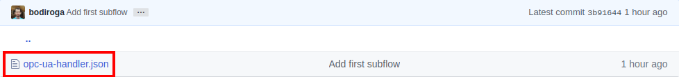
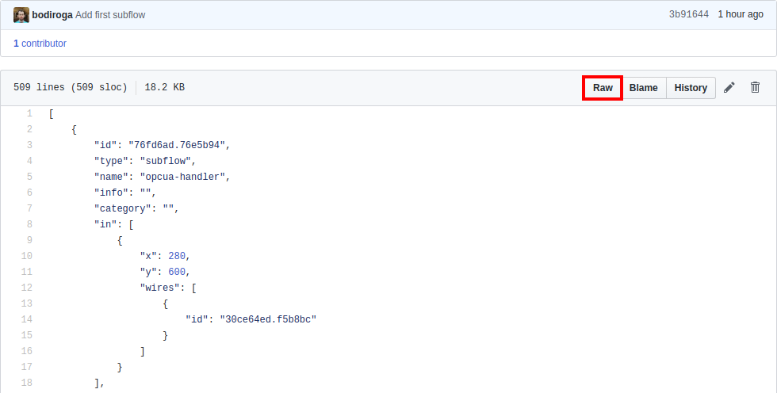
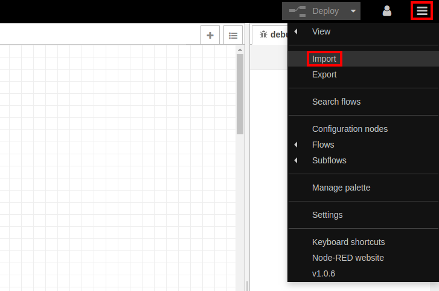
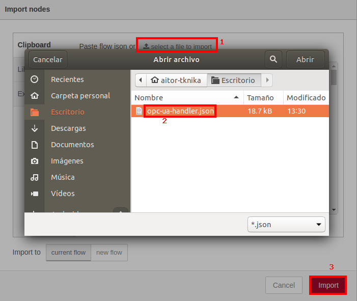
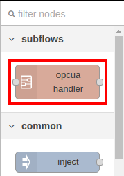

# Node-RED Subflows

## Introduction

In this repository different Node-RED subflows can be found, to facilitate the accomplishment of basic tasks related to Industry 4.0.
Each subflow is available in its own folder with detailed instructions.

- [OPC UA Handler](./opc-ua-handler-v3)
- [Send email](./send-email)
- [Timeseries2CSV](./timeseries2csv)

## Installation

All subflows can be installed in the same way, although some may depend on other modules.
In that case, the modules to be installed will be specified in the documentation of the subflow itself.
In general, the installation process is as follows:

- Go to the folder of the subflow to be installed:

- Click on the .json file:

- Press the "Raw" button:

- Right click on the text and download the file using the "Download as..." option:

- Within Node-RED, in the options menu (icon at the top right of the screen), choose the "Import" option:

- Load the subflow pressing the "select a file to import" button (1), selecting the downloaded .json file (2) and clicking the "Import" button (3):

- The subflow will be available on the pallet (left column):

## Author

(c) 2021 [Tknika](https://tknika.eus/) ([Aitor Iturrioz](https://github.com/bodiroga))

Licensed under the Apache License, Version 2.0 (the "License");
you may not use this file except in compliance with the License.
You may obtain a copy of the License at

    http://www.apache.org/licenses/LICENSE-2.0

Unless required by applicable law or agreed to in writing, software
distributed under the License is distributed on an "AS IS" BASIS,
WITHOUT WARRANTIES OR CONDITIONS OF ANY KIND, either express or implied.
See the License for the specific language governing permissions and
limitations under the License.