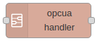
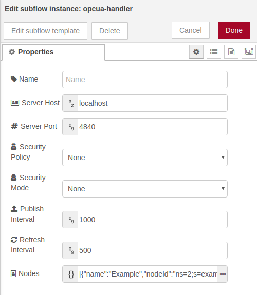
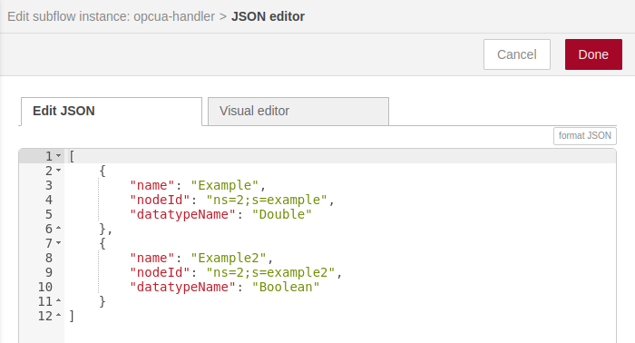
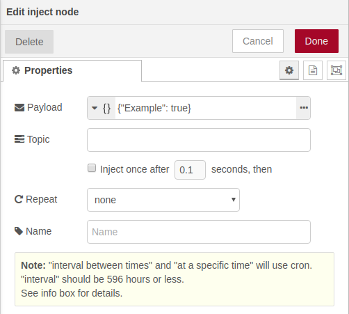
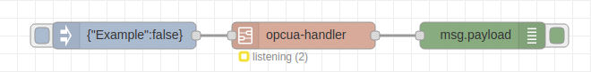

# OPC UA Handler




## Introduction

> Warning: this subflow depends on the [node-red-contrib-iiot-opcua](https://www.npmjs.com/package/node-red-contrib-iiot-opcua) package and it must be installed first.

This subflow makes reading and writing data from a OPC UA server very easy. 
All the configuration is handled by a single Node-RED node and the input and output data is simplified to just show the relevant information: the node value.

The node has one input and one output.
The input link is used to write data to the OPC UA nodes and the output will be fired whenever a OPC UA node changes its value.


## Configuration

This image shows the configuration parameters of the subflow:



- **Server Host**: IP address or hostname of the OPC UA server.
- **Server Port**: listening port of the OPC UA server.
- **Security Policy**: security policy to create the connection with the server. The chosen value must be supported by the server.
- **Security Mode**: defines if the communication with the server is signed and encrypted, just signed or if the messages are sent in plain text (unsecure).
- **Publish Interval**: frequency at which new values of the variables will be sent.
- **Refresh Interval**: frequency at which the server will update its internal variables.
- **Nodes**: list of OPC UA nodes that will be handled by the subflow. This parameter has a special syntax defined below: 

### Nodes parameter



This parameter follows the JSON syntax and must contain a list of JSON object, one object per OPC UA node (variable).

Each object must have three parameters:

- **name**: descriptive name that will be used when reading or writing data.
- **nodeId**: OPC UA Node ID, with the value of the namespace (ns) and the node identifier. This value can be obtained using any Desktop OPC UA client ([UaExpert](https://www.unified-automation.com/products/development-tools/uaexpert.html), for example).
- **datatypeName**: datatype of the node value. Possible options: Boolean, Double, Int64, String, DateTime, Byte,...


## Reading values

The subflow will listen to changes in the OPC UA nodes (defined in the [Nodes](#nodes-parameter) configuration parameters) as soon as the subflow is deployed. 
A single message will be fired for each change and the message will have the following structure:


The payload (msg.payload) is a key-value object, where the 'key' is the name of the OPC UA node written in the configuration and the 'value', as its name suggests, the value of the variable.


## Writing values

The subflow allows to write data on a OPC UA node (as long as the node allows it, of course) and for that, a message following the pattern described in the previous section must be send:

```json
msg.payload = { "Node ID name": New value}
```

This can be done, for example, using an inject node:




## Flow example

The following image shows a complete flow:

