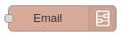
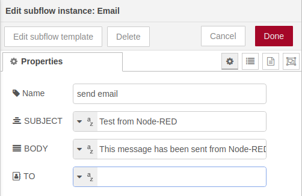
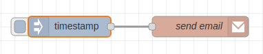

# Send email




## Introduction

> Warning: this subflow depends on the [node-red-node-email](https://flows.nodered.org/node/node-red-node-email) package and it must be installed first.

This subflow makes sending **static emails** easier when a SMTP relay service is already installed in the machine (Postfix, OpenSMTPD, Sendmail...). 
The configuration of the SMTP relay service will not be described in this document, as there are numerous tutorials on the Internet. Besides, the [IoMBian distribution](https://github.com/Tknika/iombian) already comes with a pre-configured prefix installation.

The node is an output node and all the email information is defined in its configuration.


## Configuration

The following image shows the configuration parameters of the subflow:



- **Subject**: Subject text of the email to be sent.
- **Body**: Body text of the email to be sent.
- **To**: Address to which the email will be sent.

As it can be seen, all the email information is preconfigured, so it can not be dinamically modified with the ```msg.payload``` information. This means that it doesn't matter what type of node is attached to the email node, everytime the flow is executed the email will be sent.


## Flow example

The following image shows a complete flow:

