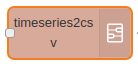
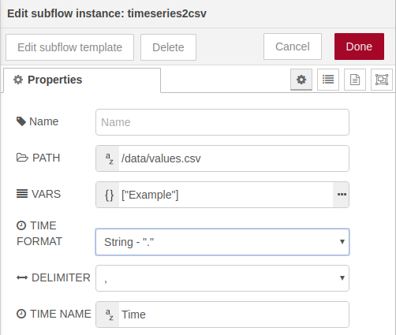
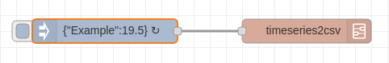
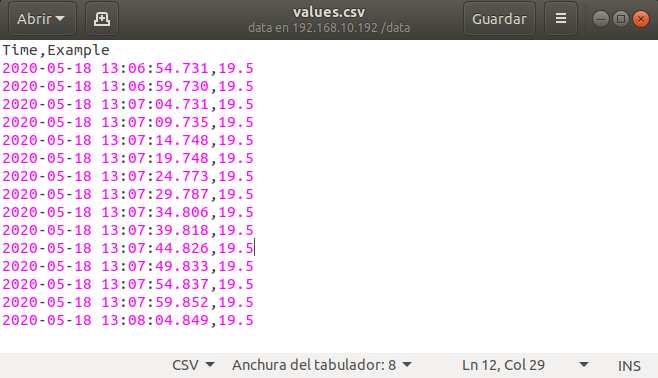

# Timeseries2CSV




## Introduction

This subflow helps to store timeseries information in a local file (inside the hard disk or the uSD card) following the CSV (comma-separeted values) format.
It is very useful when you want to track some variables that evolve over time, saving the values in a .csv file and analyzing the data later in a spreadsheet (Libreoffice Calc, Google Spreadsheet or Microsoft Excel).
The subflow will create the .csv file, add a first row with the name of each column and write a new line every time a variable changes its value.

The node is an output node and the .csv configuration can be defined with its configuration parameters.


## Configuration

The following image shows the configuration parameters of the subflow:



- **Path**: Absolute path where the file will be stored.
- **Vars**: List of variables that will be added to the file as columns. The time column is handled separately, do not add it here.
- **Time format**: Format in which the day/time information will be represented. Three options: ```2020-05-18 14:00:00.000``` (String - ".", by default), ```2020-05-18 14:00:00,000``` (String - ",") and ```1589810400000``` (epoch)
- **Delimiter**: Symbol to be used as a separator between columns: ```,``` or ```;``` (```,``` by default)
- **Time Name**: Name to be used for the time column.

## Writing values

To add new values to the .csv file, it is necessary to send a message with the following format:

```
msg.payload = { "<var_name_1>": "<var_value_1>", "<var_name_2">: "<var_value_2>"}
```

It is mandatory for the variables (```<var_name_1>``` and ```<var_name_2>```) to have been previously declared in the [```Vars```](#configuration) parameter of the node configuration.
However, it is not required to update all the variables at the same time, the message payload can contain a single or many variables.


## Flow example

The following image shows a complete flow:



The inject node contains the following payload:

```{ "Example": 19.5 }```

and the flow is executed every 5 seconds (```repeat interval: every 5 seconds```).

The generated .csv file can be seen below:

